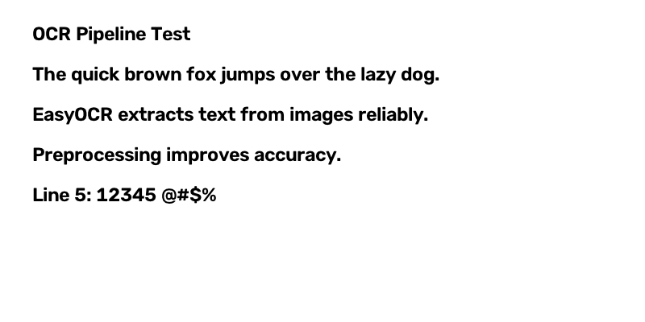

# OCR Pipeline

A lightweight Python OCR pipeline that preprocesses an input image, extracts text, and returns structured output.

## Architecture

The pipeline is split into three modules:

| Module            | Responsibility                                      |
|-------------------|-----------------------------------------------------|
| `preprocess.py`   | Image preprocessing (grayscale, denoise, threshold, deskew, upscale) using OpenCV |
| `ocr_engine.py`   | Text extraction using EasyOCR with structured result dataclasses |
| `pipeline.py`     | CLI entry point that orchestrates preprocessing + OCR |

## Setup

```bash
pip install -r requirements.txt
```

> **Note:** On Windows, set `PYTHONIOENCODING=utf-8` before the first run so EasyOCR can download its models:
> ```powershell
> $env:PYTHONIOENCODING="utf-8"; chcp 65001
> ```

## Usage

```bash
# Basic OCR - print extracted text
python pipeline.py sample_input.png

# Output with confidence scores
python pipeline.py sample_input.png --format lines

# Structured JSON output (text + confidence + bounding boxes)
python pipeline.py sample_input.png --format json

# Output to file
python pipeline.py sample_input.png -o result.txt --format json

# Skip preprocessing steps
python pipeline.py sample_input.png --no-deskew --no-denoise

# Minimum confidence filter
python pipeline.py sample_input.png --min-confidence 0.8

# Multiple languages
python pipeline.py sample_input.png -l en de fr
```

### Arguments

| Flag                  | Description                                      | Default |
|-----------------------|--------------------------------------------------|---------|
| `--format`            | Output format: `text`, `json`, `lines`           | `text`  |
| `--languages` / `-l`  | OCR languages                                    | `en`    |
| `--min-confidence`    | Minimum confidence threshold (0.0-1.0)           | `0.0`   |
| `--no-denoise`        | Skip Gaussian blur noise reduction               | off     |
| `--no-resize`         | Skip image upscaling                             | off     |
| `--no-deskew`         | Skip automatic skew correction                   | off     |
| `--dilate`            | Apply dilation after thresholding                | off     |
| `--scale`             | Upscale factor                                   | `2.0`   |
| `--gpu`               | Use GPU acceleration                              | off     |
| `-o` / `--output`     | Write output to file                              | stdout  |

## Preprocessing Steps

1. **Grayscale conversion** - simplifies the image for analysis.
2. **Noise removal** - Gaussian blur reduces sensor/compression artifacts.
3. **Upscaling** - 2x resize improves OCR accuracy on small text.
4. **Deskewing** - auto-detects and corrects text skew using minimum-area rectangle.
5. **Adaptive thresholding** - binarizes the image to separate text from background.
6. **Optional dilation** - thickens text strokes for low-quality scans.

## Sample Input / Output

### Input image



The sample image (`sample_input.png`) contains five lines of text with varying content including letters, numbers, and special characters.

### Text output

```bash
python pipeline.py sample_input.png --format text
```

```
OCR Pipeline Test
The quick brown fox jumps over the lazy dog:
EasyOCR extracts text from images reliably:
Preprocessing improves accuracy:
Line 5: 12345 @#S%
```

### Lines output (with confidence)

```bash
python pipeline.py sample_input.png --format lines
```

```
[0.73] OCR Pipeline Test
[0.81] The quick brown fox jumps over the lazy dog:
[0.78] EasyOCR extracts text from images reliably:
[0.98] Preprocessing improves accuracy:
[0.85] Line 5: 12345 @#S%
```

### JSON output

```bash
python pipeline.py sample_input.png --format json
```

```json
[
  {
    "text": "OCR Pipeline Test",
    "confidence": 0.7322,
    "bbox": [[75, 56], [481, 56], [481, 120], [75, 120]]
  },
  {
    "text": "The quick brown fox jumps over the lazy dog:",
    "confidence": 0.8063,
    "bbox": [[76, 150], [1100, 150], [1100, 222], [76, 222]]
  },
  {
    "text": "EasyOCR extracts text from images reliably:",
    "confidence": 0.7838,
    "bbox": [[73, 251], [1073, 251], [1073, 323], [73, 323]]
  },
  {
    "text": "Preprocessing improves accuracy:",
    "confidence": 0.9805,
    "bbox": [[75, 356], [854, 356], [854, 419], [75, 419]]
  },
  {
    "text": "Line 5: 12345 @#S%",
    "confidence": 0.8482,
    "bbox": [[76, 456], [546, 456], [546, 512], [76, 512]]
  }
]
```

> The `$` in `@#$%` is occasionally misread as `S` — a known limitation of OCR on special characters. Confidence scores help flag such cases programmatically.

## Approach

This pipeline uses **EasyOCR** as the OCR engine rather than Tesseract because:
- EasyOCR bundles its own deep learning models (no external binary installation required).
- It provides out-of-the-box confidence scores and bounding box coordinates.
- It handles natural scene text and varied fonts well.

**OpenCV** is used for the preprocessing stage to:
- Clean up the image before OCR to maximize recognition accuracy.
- Correct geometric issues (skew, low resolution) automatically.

The pipeline is modular: preprocessing functions can be toggled independently, and the `OCREngine` can be reused with different language models or swapped for another engine.
